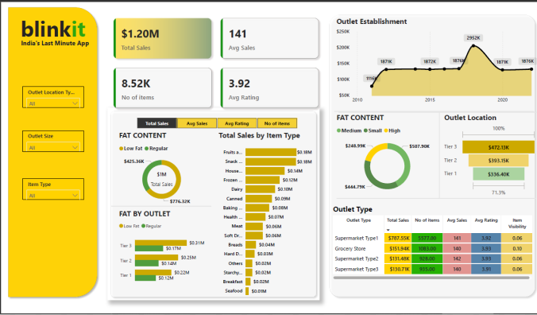

# Blinkit Sales Dashboard 📊

This project showcases a professional sales dashboard created for **Blinkit – India's Last Minute App**, aimed at deriving insights from item-level sales and outlet performance across different tiers and regions.

---

## 📸 Dashboard Preview

---

## 💡 Project Summary

The dashboard was built to analyze and visualize key metrics like total sales, average ratings, item types, and outlet trends. It offers actionable insights using slicers, KPI cards, line charts, bar graphs, and donut charts for a comprehensive overview of Blinkit's business performance.

---

## 🔧 Tools & Skills Used

- **Power BI** / Excel (based on your tool)
- Data Visualization & Dashboard Design
- Slicers & Filters
- DAX / Power Query (if applicable)
- Color Themes & UI Design Principles

---

## 📊 Key Insights & KPIs

- **Total Sales**: `$1.20M`
- **Total Items Sold**: `8.52K`
- **Average Sales per Order**: `141`
- **Average Rating**: `3.92`
- **Top Performing Outlet Type**: Supermarket Type1 (`$707.55K` in sales)
- **Most Popular Item Type**: Fruits & Vegetables (`$0.19M`)
- **Outlet Establishment Peak**: 2017-2019
- **Fat Content Sales Distribution**:
  - Medium + High: `$507.20K`
  - Low Fat + Regular: `$776.23K`

---

## 📂 Project Files

- `blinkit-dashboard.pbix` or `blinkit-dashboard.xlsx` *(Add the working dashboard file here)*
- `blinkit-dashboard-snapshot.png` *(Dashboard image)*
- `README.md` *(This file)*

---

## 🎯 Objective

To empower business analysts and decision-makers with a real-time overview of item-wise and outlet-wise sales trends, customer preferences, and outlet growth patterns.

---

## 📝 Notes

> This is a self-created project for learning and portfolio building purposes. Data is simulated and not from the actual Blinkit company.

---

## 🔗 Connect with Me

**Gagan Kumar**  
📧 [gag4kumar@gmail.com](mailto:gag4kumar@gmail.com)  
🔗 [GitHub](https://github.com/Gagan4141)  
🔗 [LinkedIn](https://www.linkedin.com/in/gagan-kumar-801445191)

